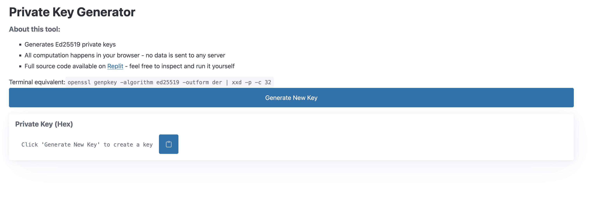

# Ed25519 Key Generator


Simple web tool to generate Ed25519 private keys in your browser. 




Equivalent to running:

```
openssl genpkey -algorithm ed25519 -outform der | xxd -p -c 32
```


## Try it

- Live page: https://pk-generator.replit.app/
- Replit source + run: https://replit.com/t/fewsats/repls/pk-generator/view
- Github: https://github.com/fewsats/pk-generator

## Features

- Client-side key generation using Web Crypto API
- No server-side processing

Built with [FastHTML](https://github.com/fastai/fasthtml)
